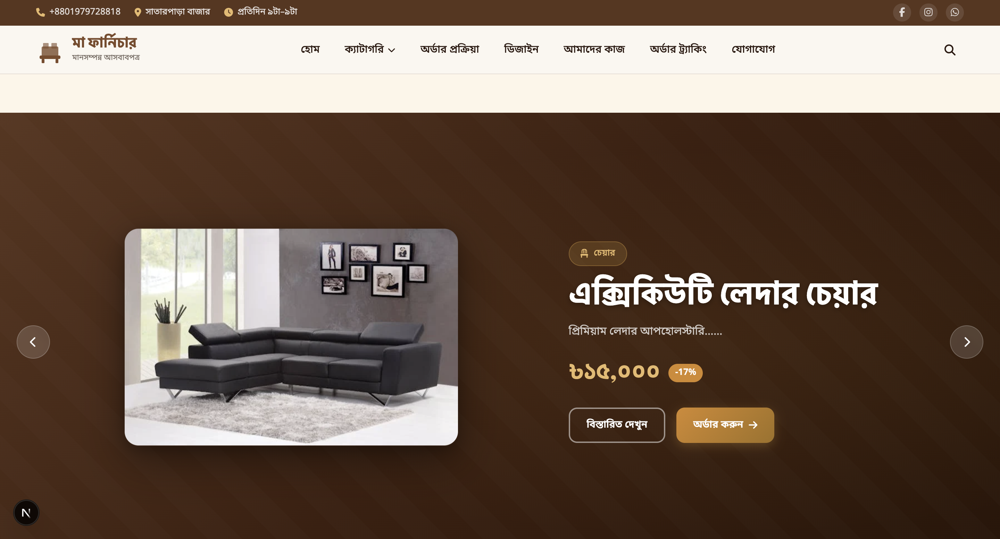

# আল-আমিন ফার্নিচার

A complete production-ready Bangladeshi furniture e-commerce website.



## Quick Start

```bash
npm install
npm start
```

Open `http://localhost:3000`

## Pages

| Route | Description |
|-------|-------------|
| `/` | Homepage with slider, search, categories |
| `/category/:id` | Category product listing |
| `/search` | Search results with filters |
| `/admin` | Admin panel (Password: `furniture2024`, Demo: `demo123`) |

- Main Password : furniture2024
- Demo Password : demo123
You can now use demo123 to log in to the admin panel at http://localhost:3000/admin .

Completed

Diff

25%

## Tech Stack

- Next.js (React Framework)
- Supabase (PostgreSQL Database & Auth)
- Pure CSS (Custom styles & animations)
- Vanilla JavaScript (ES6+)

## Project Structure

```text
my_shop_3/
├── package.json
├── next.config.mjs
├── supabase_schema.sql
├── public/
└── src/
    ├── app/
    │   ├── admin/
    │   ├── category/
    │   ├── search/
    │   ├── order-tracking/
    │   ├── layout.js
    │   └── page.js
    ├── components/
    │   ├── admin/
    │   ├── home/
    │   ├── tracking/
    │   ├── Header.js
    │   └── Footer.js
    └── lib/
        └── supabaseClient.js
```

## Features

- Fully responsive (320px to 1920px+)
- Hero slider with 5 slides
- Product detail modal with image gallery
- WhatsApp order integration
- Admin panel for product management
- Live search with debouncing
- Recently viewed products (localStorage)
- Sticky category navigation
- Mobile bottom navigation
- Floating WhatsApp button
- 48 products across 8 categories

## Admin Dashboard Features

The platform includes a powerful, fully-featured Admin Dashboard. Key capabilities include:

- **Comprehensive Product Management**: Easily add, edit, track, and delete products from your catalog.
- **Advanced Multi-Image Upload**: Dynamically add and manage up to 5 images per product to create immersive product galleries.
- **Order Lifecycle & Tracking System**: Define custom tracking stages and manage the complete lifecycle of customer orders.
- **Order Management & Review**: View all orders automatically sorted in chronological order (newest first). Securely delete orders with a built-in safety confirmation modal.
- **Store Profile & Settings**: Manage your store's profile information, metadata, and design specifications directly from the admin panel.
- **Real-Time Data Sync**: All dashboard interactions and data updates are instantly synchronized with the Supabase backend for full data persistence.
